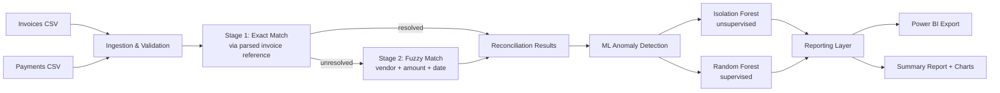
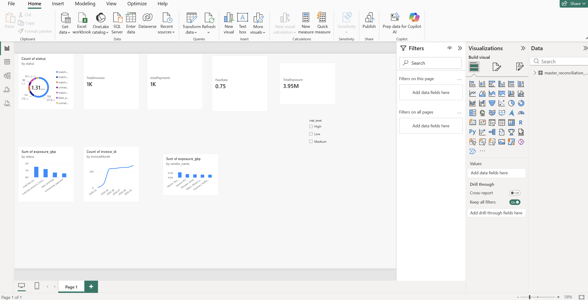

# AI-Powered Accounts Payable Reconciliation Platform

Automated invoice-to-payment reconciliation with rules-based matching and machine-learning anomaly detection — built end-to-end in Python, with a Power BI-ready reporting layer.

> **Why this project exists:** During my time managing stock and till reconciliation at Shell, I regularly reconciled daily closing balances against fuel volume and stock records by hand — cross-checking amounts, chasing discrepancies, and flagging anything that didn't line up. This project automates that exact workflow for accounts payable: matching invoices to payments, catching amount mismatches, duplicate payments, and orphan transactions, and scoring anomalies with machine learning instead of a manual spot-check.

## The Problem

Companies reconciling invoices against bank/ledger payments manually lose hours to a process that is mostly pattern-matching: does this payment match an invoice, is the amount right, has this already been paid, does anything look off? At scale, mistakes and fraud-like patterns (duplicate payments, orphan transactions) hide in the volume. This is a real, well-established enterprise software category (AP automation / financial close tools).

## What This Does

1. **Ingests** invoice and payment records, validating structure and data quality before anything else touches them
2. **Reconciles** them in two stages — exact matching via parsed invoice references, then fuzzy matching (vendor name + amount + date) for anything the exact stage couldn't resolve (e.g. bank feeds with garbled or missing references)
3. **Scores anomalies with ML** — comparing an unsupervised Isolation Forest against a supervised Random Forest classifier, rather than relying on rules alone
4. **Reports** results as a clean, Power BI-ready flat table plus a human-readable summary with charts and financial exposure figures

## Architecture



## Results

Run on a 1,200-invoice synthetic dataset with six deliberately planted discrepancy types (clean payments, amount mismatches, duplicate payments, orphan payments, vendor-name typos, date anomalies):

| Metric | Result |
|---|---|
| Reconciliation accuracy vs. ground truth | **97.6%** |
| Orphan payment detection rate | 90% (36/40) |
| Clean pass rate | 74.9% |
| Total flagged financial exposure | £3.95M across 444 records |

**ML model comparison** (Isolation Forest = unsupervised, Random Forest = supervised):

## Dashboard
 

Built in Power BI on top of `reports/master_reconciliation_export.csv`. Open `Dashboard/reconciliation_dashboard.pbix.pbix` to explore it live.

| Metric | Isolation Forest | Random Forest |
|---|---|---|
| Precision | 0.513 | 0.927 |
| Recall | 0.513 | 0.957 |
| F1 | 0.513 | 0.942 |
| ROC-AUC | 0.830 | 0.976 |

Top features driving the Random Forest: duplicate-payment grouping (33%), amount % difference (27%), payment date lag (19%).

## Honest Limitations (and why they're there on purpose)

- **The Random Forest's near-perfect score partly reflects that its features are derived directly from the same signals used to define the anomaly labels** (amount difference, duplicate grouping, date lag). It's a strong classifier on *known* patterns, not proof it discovered hidden fraud signals from scratch — that's exactly why it's paired with Isolation Forest, which gets no such advantage.
- **Isolation Forest's `contamination` parameter was set using the true anomaly rate from the synthetic ground truth**, a simplification. In a real deployment you wouldn't know that rate upfront and would estimate it from historical audit data.
- **The "pass rate" (74.9%) excludes matched duplicates and date anomalies**, since those *were* successfully matched — they just also need human follow-up. It also excludes unpaid invoices, which aren't errors, just not yet due. Read it as "records needing zero follow-up," not a system failure rate.
- **Currency conversion uses fixed FX rates** for exposure reporting, not live rates.
- **The dataset is synthetic**, generated with realistic but deliberately planted discrepancy patterns, since real company financial data isn't available for a portfolio project. The generation logic is fully documented in `src/generate_data.py`.

## Tech Stack

- **Python** — pandas, NumPy for data processing
- **scikit-learn** — Isolation Forest, Random Forest
- **RapidFuzz** — fuzzy string matching for vendor name resolution
- **Matplotlib** — reporting visuals
- **Power BI** — designed as the downstream dashboarding layer (`master_reconciliation_export.csv` is the data source; connect it directly in Power BI Desktop to build live visuals)
- **pytest** — unit tests on core matching logic

## Project Structure

```
recon-project/
├── src/
│   ├── generate_data.py   # synthetic dataset generator
│   ├── ingest.py           # loading, cleaning, structural validation
│   ├── reconcile.py        # exact + fuzzy matching engine
│   ├── ml_anomaly.py       # Isolation Forest vs Random Forest
│   └── report.py           # KPIs, Power BI export, charts
├── tests/
│   └── test_pipeline.py    # unit tests on matching/validation logic
├── data/                   # generated CSVs (invoices, payments, ground truth)
├── reports/                # all pipeline outputs (git-ignored by default)
├── run_pipeline.py         # single entry point: runs every stage
└── requirements.txt
```

## Running It

```bash
pip install -r requirements.txt
python3 run_pipeline.py
```

This runs all five stages end to end and populates `reports/` with:
- `master_reconciliation_export.csv` — open this directly in Power BI Desktop
- `SUMMARY.md` — human-readable report with embedded charts
- `charts/*.png` — status distribution, financial exposure, monthly trend, top vendors

To run the test suite:

```bash
pytest tests/ -v
```

## Possible Extensions

- Optimal (Hungarian-algorithm) assignment instead of greedy fuzzy matching, to avoid rare false-positive matches on orphan payments
- A live Power BI dashboard built on top of the export (screenshots to be added)
- Multi-currency live FX rate lookup
- Semi-supervised active learning loop: feed confirmed Isolation Forest flags back in as labels to bootstrap the supervised model over time
